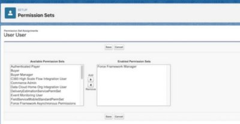
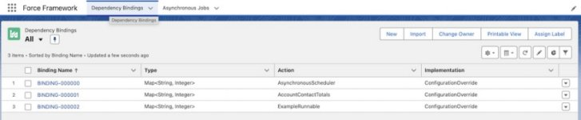
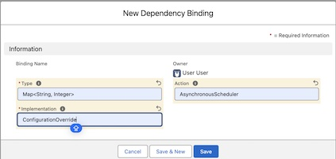

[back](README.md)

# Getting Started

## Deployment
You may deploy the package or the code to your org.

#### Package
To deploy the package, use the package link for the package version you wish to deploy. It is recommended
that you always deploy the latest version of the package.

#### Code
If you are deploying the code to an org which has a namespace, the permission set groups will fail to deploy. To
allow deployment, edit each of the permission set group files and add your org's namespace prefix to each of the
permission sets in the file.

#### Example Code

If using an org with the package deployed, deploy the code in the _example.pkg_ directory to the org.

If your org has the source code deployed, deploy the code in the _example_ directory to it.

# Permission Sets

The following section describes the permissions sets required to use and manage _Force Framework_ and the example code.

#### Force Framework Manager

This permission set is required to manage _Force Framework_. This allows the assigned user full administrative access.
To grant administrative access, assign the _Force Framework Manager_ permission set to the
user(s) you want to grant the access to. Once assigned to the user, they should see the _Force Framework_ app in
App Launcher.

 &nbsp;&nbsp; 

On selection of the _Force Framework_ app, the following page will be displayed. Select the _All_ list view
and pin it as the default list view.

Select the _Asynchronous_ tab. Select the _All_ list view and pin it as the default list view.

#### Force Framework User

Users can be granted to use _Force Framework_ API(s) without administrative access by assignment of one or more
of these  permission sets.

| Permission Set                                   | Purpose                                                 |
|--------------------------------------------------|---------------------------------------------------------|
| Force Framework Dependency Injection Permissions | Allows a user to use dependency injection in Apex code. |
| Force Framework Asynchronous Permissions         | Allows a user to run asynchronous jobs.                 |

It is cumbersome to have to assign permission sets individually. For example, to use the Asynchronous API,
the user also needs access to use Dependency Injection. A permission set group named _Force Framework User_
can be assigned to a user to grant full non-administrative access to the _Force Framework_ APIs.

### Adding A Dependency Binding
From the _Dependency Bindings_ tab, select _New_.

The following example shows adding a _Binding_ to set the configuration for the _Asynchronous Scheduler_.

