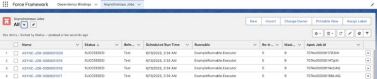

[back](README.md)
# Force Framework Setup
## Deployment
You may deploy the package or the code to your org.

To deploy the package, use the package link for the package version you wish to deploy. It is recommended
that you always deploy the latest version of the package.

If you are deploying the code to an org which has a namespace, the permission set groups will fail to deploy. To
allow deployment, edit each of the permission set group files and add your org's namespace prefix to each of the
permission sets in the file.

# Force Framework Manager
The following section describes how to set up and manage _Force Framework_.

### Granting Access
To grant administrative access to _Force Framework_, assign the _Force Framework Manager_ permission set to the
user(s) you want to grant the access to. Once assigned to the user, they should see the _Force Framework_ app in
App Launcher.

 &nbsp;&nbsp; 

On selection of the _Force Framework_ app, the following page will be displayed. Select the _All_ list view
and pin it as the default list view.

Select the _Asynchronous_ tab. Select the _All_ list view and pin it as the default list view.

### Adding A Dependency Binding
From the _Dependency Bindings_ tab, select _New_.

The following example shows adding a _Binding_ to set the configuration for the _Asynchronous Scheduler_.

